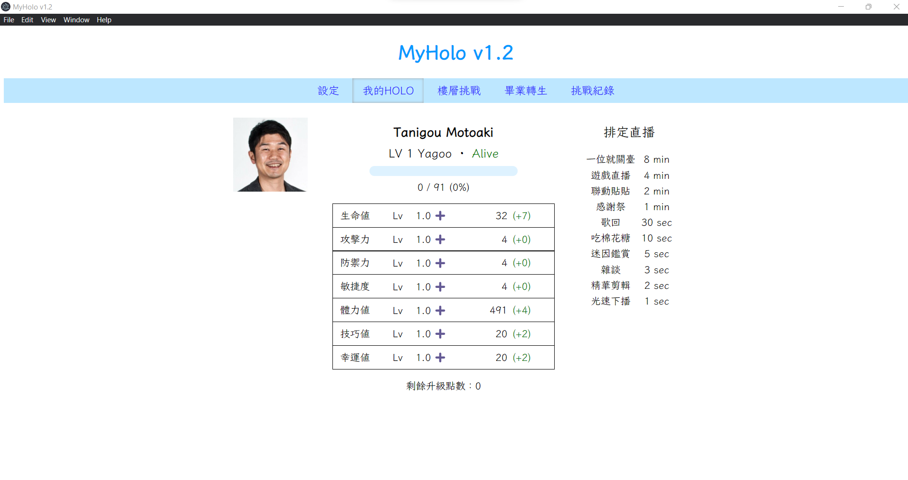
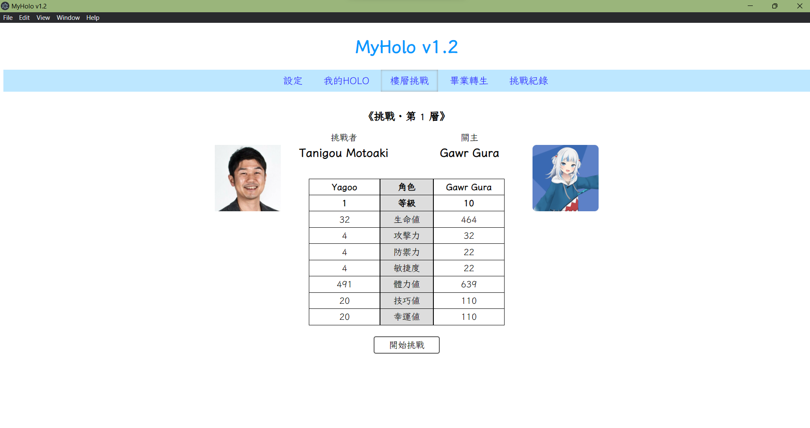
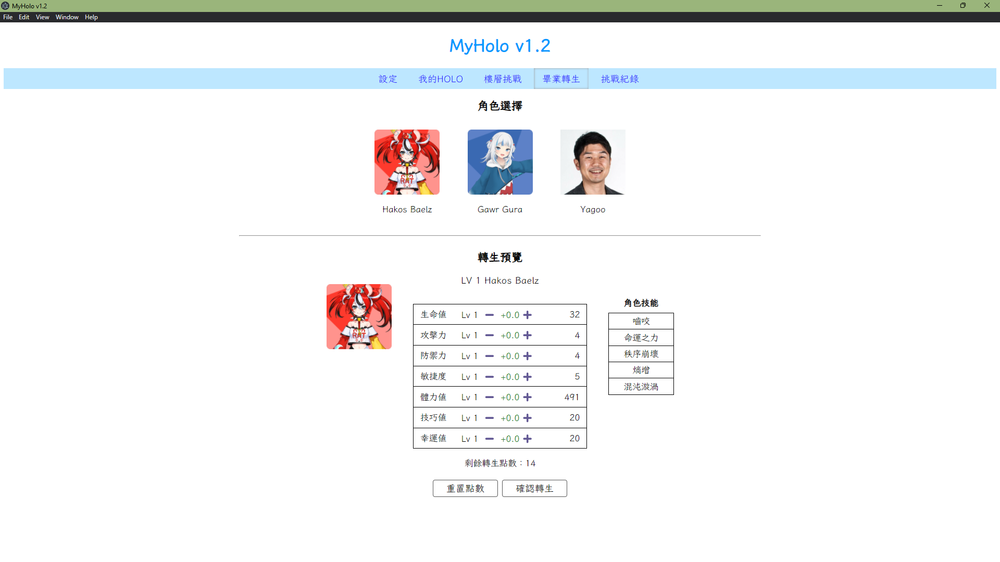
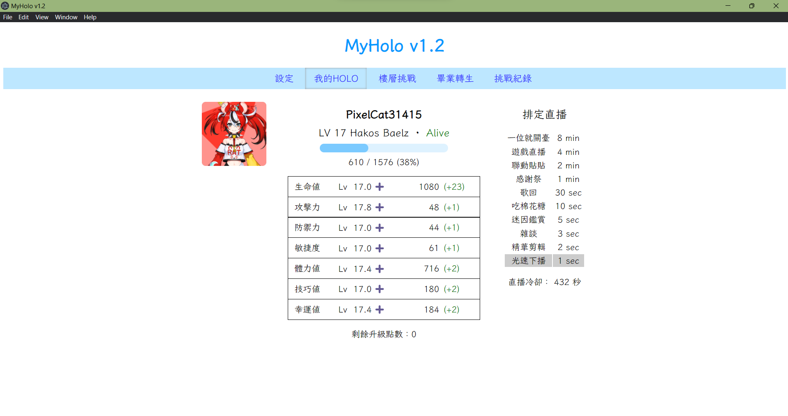

# MyHolo

A simple idle game made by two Hololive fans. Inspired by the game MyKirito.
由兩位 Hololive 粉絲製作的、一個簡單的閒置遊戲，受遊戲 MyKirito 啟發。

## 建置

目前只有 Windows 平台上的執行檔，然而你可以自行建置適用於其他平台（linux/MaxOS）的遊戲執行檔。

前置需求（不確定更低的版本能否正常執行）：

1. Node.js 16.13.1

建置執行檔:

1. clone 或下載此 repo
2. 執行 `npm install` 安裝需要的套件
3. 執行 `npm run make` 建置專案
4. 遊戲執行檔將會輸出到 `./out/myholo-{your-system}/` 目錄

然而本遊戲沒有對 node 套件做任何優化，因此安裝套件可能需要一些時間/空間。

## 遊戲介紹

### 遊戲背景

> YAGOO（你）是一名偶像經濟公司底層職員，名義上是社長卻只有吉祥物功能。隨著公司旗下偶像們越來越混沌，你終於看不下去了，決定一一挑戰他們，希望能喚回清楚純真的偶像們。

### 遊戲玩法

單人遊戲，玩家藉由操控角色練等變強，戰勝各樓層的boss。

1. 練等
   遊戲中角色有等級，當擁有一定數量的經驗值後即可升級，等級與代表戰鬥力的能力值直接相關每升一級，除了各能力值固定的提升，還能得到自由分配的「升級點數」，可提升單項能力值。。有兩種方式可以得到經驗值：
   1. 遊戲內有數學函數代表時間與經驗值的關係，透過放置（掛機）來等待經驗值增加。
   2. 打boss獲得經驗值（見「爬塔」段落）
2. 爬塔
   遊戲進程由數個樓層組成，每層有一個boss。玩家可以挑戰boss，勝利可獲得經驗值、解鎖新角色，並獲得「轉生點數」；若失敗則角色死亡。
3. 轉生
   若角色畢業（死亡）或希望更換角色，可以進行「轉生」。轉生後樓層重置，角色等級、能力值部分保留。若轉生前有擊敗boss獲得「轉生點數」，可在轉生時分配，提高角色能力。

### 遊戲畫面

## 版權聲明

我們 **並不擁有** 任何圖片素材的版權。圖片素材來自

- Hololive 官網 [https://hololive.hololivepro.com/en/talents](https://hololive.hololivepro.com/en/talents)
- 萌娘百科 [https://zh.moegirl.org.cn/](https://zh.moegirl.org.cn/)

其餘程式碼在 [WTF Public license](http://www.wtfpl.net/) 下發布。

<!-- 
## 未加入的特性

### TODO

一些還沒做完的功能。

- 成就系統
- 遊戲應用程式圖標

### 更多 TODO

高機率（永遠）不會完成的功能。

- 完整的程式碼註解
- 遊戲內教學、提示
- 遊戲事件訊息顯示

### 有生之年系列

一些未來可能會發展的方向，除非我們有超級多時間而且對這個遊戲極度有愛不然不可能完成，因為任何一項都會要幾乎重寫大半個遊戲。

- 擺脫弱型別毒瘤，擁抱 TypeScript 正道。
- 處理前端的義大利麵腳本，學習使用 Vue.js 之類好用的框架
- 重新組織處於量子糾纏中的（玩家和關主的）角色系統
- 學習用 MySQL 之類的資料庫存遊戲檔案（不確定會有什麼實質效果不過聽起來很酷）
 -->
